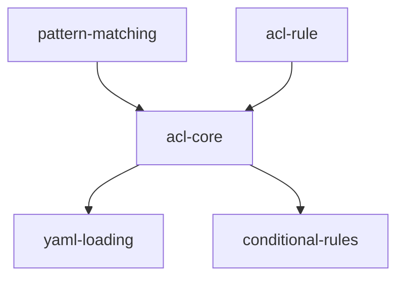

# Implementation Plan: ACL System

## Goal

Implement a pattern-based Access Control List system with first-match-wins evaluation, wildcard pattern support, special identity patterns, conditional rules, YAML configuration loading with hot-reload, and thread-safe operations.

## Architecture Design

### Component Structure

The ACL system is built from two source files with three logical components:

- **`match_pattern()`** (`utils/pattern.py`, 46 lines) -- Foundation wildcard matching utility supporting `*` as a wildcard matching any character sequence including dots. Handles prefix, suffix, infix, and full wildcards via segment splitting. Pure function with no dependencies.

- **`ACLRule`** (`acl.py`) -- Dataclass with `callers: list[str]`, `targets: list[str]`, `effect: str` ("allow"/"deny"), optional `description: str`, and optional `conditions: dict[str, Any]`. A simple data container with no behavior.

- **`ACL`** (`acl.py`, 279 lines total) -- Main class managing an ordered rule list. Core methods:
  - `check(caller_id, target_id, context)` -- First-match-wins evaluation with copy-under-lock
  - `add_rule(rule)` -- Inserts at position 0 (highest priority)
  - `remove_rule(callers, targets)` -- Removes first matching rule by pattern lists
  - `load(yaml_path)` -- Classmethod for YAML loading with strict validation
  - `reload()` -- Hot-reloads from original YAML path

### Data Flow

```
check(caller_id, target_id, context)
  |
  +--> effective_caller = "@external" if caller_id is None else caller_id
  |
  +--> Copy rules + default_effect under lock
  |
  +--> for each rule (first-match-wins):
  |      1. Caller patterns: OR logic (any pattern match suffices)
  |         - @external -> value == "@external"
  |         - @system -> context.identity.type == "system"
  |         - others -> match_pattern(pattern, value)
  |      2. Target patterns: OR logic
  |      3. Conditions: AND logic (all must pass)
  |         - identity_types: context.identity.type in list
  |         - roles: set intersection with context.identity.roles
  |         - max_call_depth: len(context.call_chain) <= threshold
  |      4. Match found -> return rule.effect == "allow"
  |
  +--> No match -> return default_effect == "allow"
```

### Technical Choices

- **First-match-wins**: Rules are evaluated in order; the first matching rule determines the decision. This is simpler and more predictable than weighted priority or most-specific-match systems.
- **Copy-under-lock for `check()`**: The rule list and default effect are copied under the lock, then evaluation proceeds without the lock. This allows concurrent `check()` calls with minimal contention.
- **Special pattern resolution in `_match_pattern()`**: `@external` and `@system` are resolved locally in `ACL._match_pattern()` before delegating to the generic `match_pattern()` utility, keeping the utility free of ACL-specific concerns.
- **Strict YAML validation**: Every structural field is validated during `ACL.load()` with descriptive error messages, preventing malformed configs from silently misbehaving.

## Task Breakdown



| Task ID | Title | Estimated Time | Dependencies |
|---------|-------|---------------|--------------|
| pattern-matching | Wildcard pattern matching utility | 1h | none |
| acl-rule | ACLRule dataclass | 0.5h | none |
| acl-core | ACL class with check(), add_rule/remove_rule, thread safety | 3h | pattern-matching, acl-rule |
| yaml-loading | ACL.load() classmethod and reload() | 2h | acl-core |
| conditional-rules | Conditions support (identity_types, roles, max_call_depth) | 2h | acl-core |

## Risks and Considerations

- **Thread safety vs. performance**: The lock is held only for copying the rule list in `check()`, but concurrent `add_rule`/`remove_rule` mutations still serialize. This is acceptable since rule mutations are rare operations.
- **YAML validation completeness**: Strict validation catches structural errors but cannot validate pattern semantics (e.g., a typo in a caller pattern will be accepted). Runtime logging of access decisions helps diagnose misconfigurations.
- **Condition evaluation without context**: When `context` is `None` but a rule has conditions, the rule does not match. This is by design but could cause unexpected denials if callers forget to provide context.
- **Pattern matching edge cases**: Multiple `*` wildcards, empty strings, and patterns with only `*` are all handled by the `match_pattern()` utility and covered by tests.

## Acceptance Criteria

- [ ] `match_pattern()` correctly handles exact, wildcard `*`, prefix (`executor.*`), and edge cases
- [ ] `ACL.check()` implements first-match-wins with correct OR/AND logic
- [ ] `@external` matches `None` callers; `@system` matches system-type identities
- [ ] Default effect applies when no rule matches
- [ ] `ACL.load()` validates YAML structure and raises descriptive errors for all malformed inputs
- [ ] `add_rule()` inserts at position 0; `remove_rule()` returns `True`/`False`
- [ ] `reload()` re-reads the YAML file and updates rules in-place
- [ ] Conditional rules evaluate `identity_types`, `roles`, `max_call_depth` correctly
- [ ] Thread safety validated under concurrent load (10 threads x 200 iterations)
- [ ] All tests pass with zero ruff/black/pyright warnings

## References

- Source: `src/apcore/acl.py`, `src/apcore/utils/pattern.py`
- Tests: `tests/test_acl.py`, `tests/test_pattern.py`
- Integration: `tests/integration/test_acl_enforcement.py`
- Feature spec: [acl-system.md](../../features/acl-system.md)
