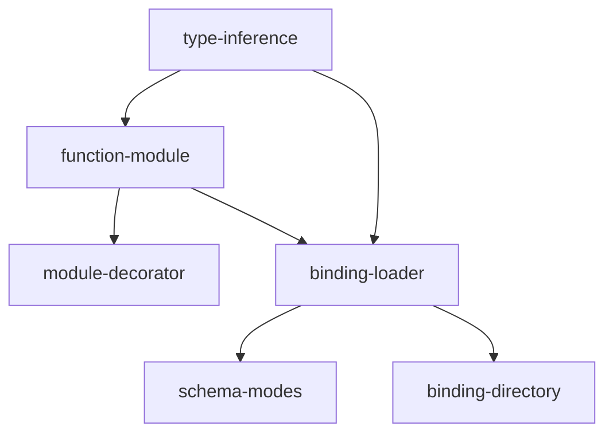

# Implementation Plan: Decorator & Bindings

## Goal

Implement two complementary module registration approaches -- a `@module` decorator for code-first development and a `BindingLoader` for YAML-driven zero-code-modification integration -- both sharing a type inference engine for automatic Pydantic model generation from function signatures.

## Architecture Design

### Component Structure

The system is split across two source files with shared type inference utilities:

**Decorator System** (`decorator.py`, 264 lines):

- **`_generate_input_model(func)`** -- Converts function parameter signatures into dynamic Pydantic `BaseModel` classes. Uses `typing.get_type_hints(include_extras=True)` for forward reference support. Skips `self`/`cls`, `*args`, `**kwargs` (but records `**kwargs` presence for `extra="allow"`), and `Context`-typed parameters. Raises `FuncMissingTypeHintError` for untyped parameters.

- **`_generate_output_model(func)`** -- Converts return type annotations. Maps: `dict`/`dict[str, T]` to permissive model, `BaseModel` subclass returned directly, `None` to empty permissive model, other types to model with single `result` field. Raises `FuncMissingReturnTypeError` if no return annotation.

- **`_has_context_param(func)`** -- Type-based (not name-based) detection of `Context`-typed parameters. Returns `(bool, param_name)`.

- **`_normalize_result(result)`** -- Converts return values: `None` to `{}`, `dict` passthrough, `BaseModel` to `model_dump()`, others to `{"result": value}`.

- **`FunctionModule`** -- Wrapper class providing `module_id`, `input_schema`, `output_schema`, `description`, and `execute()`. Creates separate sync/async execute closures at construction time so `inspect.iscoroutinefunction()` returns the correct value. Context parameter injection based on `_has_context_param()`. Description priority: explicit > first docstring line > `"Module {func_name}"`.

- **`_make_auto_id(func)`** -- Generates module ID from `func.__module__` + `func.__qualname__`, lowercased, non-alphanumeric replaced with `_`, digit-leading segments prefixed with `_`.

- **`module()`** -- Dual-purpose decorator/function. Works as bare `@module`, with arguments `@module(id="x")`, and as function call `module(func, id="x")`. Optional `registry` parameter for immediate registration.

**Binding System** (`bindings.py`, 220 lines):

- **`BindingLoader`** -- Loads YAML binding files containing `bindings` list. Each entry requires `module_id` and `target`. Fail-fast on first error.

- **`resolve_target(target_string)`** -- Parses `module.path:callable` format via `importlib.import_module()`. Supports class method binding (`Class.method`) with auto-instantiation of no-arg constructors. Five specific error types for each failure mode.

- **`_build_model_from_json_schema(schema)`** -- Converts JSON Schema `properties` to Pydantic models. Maps `string`/`integer`/`number`/`boolean`/`array`/`object` to Python types. Handles `required` array. Falls back to permissive model for unsupported features (`oneOf`, `anyOf`, `allOf`, `$ref`, `format`).

- **`_create_module_from_binding(entry)`** -- Resolves target, determines schema mode, creates `FunctionModule`, handles all four schema modes.

- **`load_binding_dir(dir_path, registry, pattern)`** -- Scans directory with `pathlib.Path.glob()`, default pattern `*.binding.yaml`.

### Data Flow

```
Decorator path:
  @module(id="x", registry=reg)
    --> _wrap(func)
      --> _make_auto_id(func) or use explicit id
      --> FunctionModule(func, module_id, ...)
        --> _generate_input_model(func)
        --> _generate_output_model(func)
        --> _has_context_param(func) for execute closure
      --> registry.register(module_id, fm)
      --> func.apcore_module = fm (decorator) or return fm (function call)

Binding path:
  BindingLoader.load_bindings(file_path, registry)
    --> Parse YAML, validate structure
    --> For each binding entry:
      --> resolve_target("module.path:callable")
      --> Determine schema mode:
           auto_schema -> _generate_input/output_model()
           inline -> _build_model_from_json_schema()
           schema_ref -> load YAML, then _build_model_from_json_schema()
           default -> try _generate_input/output_model()
      --> FunctionModule(func, module_id, input_schema, output_schema)
      --> registry.register(module_id, fm)
```

### Technical Choices

- **Separate sync/async closures**: Two distinct closures are created at `FunctionModule` construction time so that `inspect.iscoroutinefunction(fm.execute)` returns the correct value without runtime branching.
- **Type-based Context detection**: `_has_context_param()` checks `hint is Context` rather than matching the parameter name, avoiding false positives when a parameter named "context" has a different type.
- **`get_type_hints(include_extras=True)`**: Supports `from __future__ import annotations` and `Annotated` types with pydantic `Field` constraints.
- **Permissive model fallback**: When JSON Schema contains unsupported features, the system creates a model with `extra="allow"` rather than failing, enabling graceful degradation for complex schemas.
- **Fail-fast binding loading**: The first error in any binding entry stops processing immediately, making it easy to locate and fix configuration issues.

## Task Breakdown



| Task ID | Title | Estimated Time | Dependencies |
|---------|-------|---------------|--------------|
| type-inference | Input/output model generation from function signatures | 3h | none |
| function-module | FunctionModule wrapper with sync/async execute closures | 2h | type-inference |
| module-decorator | @module decorator with three usage forms and auto-ID | 2h | function-module |
| binding-loader | BindingLoader with YAML parsing and target resolution | 3h | type-inference, function-module |
| schema-modes | Four schema modes (auto, inline, schema_ref, default) | 2h | binding-loader |
| binding-directory | Directory scanning with glob pattern | 1h | binding-loader |

## Risks and Considerations

- **Forward references**: `typing.get_type_hints()` may fail with `NameError` for unresolvable forward references. Mapped to `FuncMissingTypeHintError` with the missing name for a clear error message.
- **Async detection correctness**: The dual-closure approach requires that async detection happens at construction time. If a function's async nature changes after wrapping (unlikely but possible with proxies), the closure type would be wrong.
- **Class method binding**: Auto-instantiation requires a no-arg constructor. Classes with required constructor arguments will fail with `BindingCallableNotFoundError`, which may be confusing. The error message includes the original `TypeError`.
- **Schema mode ambiguity**: If both `auto_schema: true` and `input_schema` are specified, `auto_schema` takes priority due to the if/elif chain. This is intentional but could surprise users.
- **Import side effects**: `resolve_target()` uses `importlib.import_module()` which may trigger module-level side effects. Users should ensure imported modules are safe to load at binding time.

## Acceptance Criteria

- [ ] `_generate_input_model` handles primitives, defaults, Optional, unions, list, dict, Literal, Annotated, nested BaseModel, Context skipping, self/cls skipping, *args skipping, **kwargs extra="allow", and missing type hints
- [ ] `_generate_output_model` handles dict, BaseModel subclass, None, other types, and missing return type
- [ ] `FunctionModule` creates correct sync/async closures; `iscoroutinefunction` returns correct value
- [ ] `@module` works in all three forms (bare, with arguments, function call)
- [ ] `_make_auto_id` produces correct lowercased, sanitized IDs
- [ ] `BindingLoader` parses YAML, validates structure, resolves targets including class methods
- [ ] All four schema modes produce valid Pydantic models
- [ ] `_build_model_from_json_schema` handles all JSON types and unsupported feature fallback
- [ ] `load_binding_dir` scans directories with glob pattern
- [ ] All 8 error classes carry correct codes and details
- [ ] All tests pass with zero ruff/black/pyright warnings

## References

- Source: `src/apcore/decorator.py`, `src/apcore/bindings.py`
- Tests: `tests/test_decorator.py`, `tests/test_bindings.py`
- Feature spec: [decorator-bindings.md](../../features/decorator-bindings.md)
- Pydantic `create_model`: used for all dynamic model generation
- `typing.get_type_hints(include_extras=True)`: handles forward references and `Annotated` types
