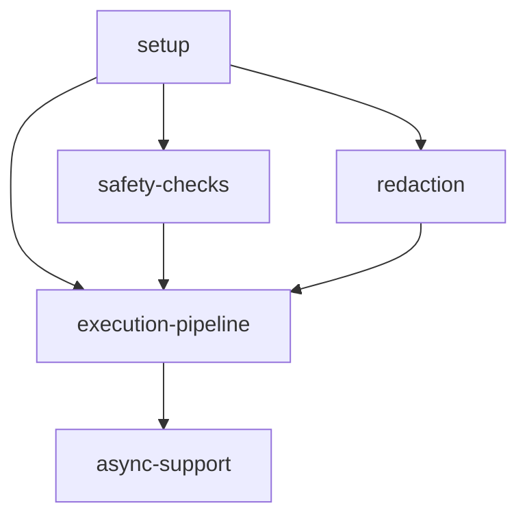

# Implementation Plan: Core Executor

## Goal

Implement the central 10-step execution pipeline that orchestrates all module calls in apcore, supporting context propagation, safety constraints, access control, schema validation with sensitive field redaction, middleware chains, and timeout-enforced module execution through both synchronous and asynchronous code paths.

## Architecture Design

### Component Structure

- **Executor** (`executor.py`, 634 lines) -- Main engine class implementing the 10-step pipeline. Accepts a `Registry`, optional `Middleware` list, optional `ACL`, and optional `Config` at construction. Manages middleware registration via `MiddlewareManager`, configurable timeouts (default 30s, global 60s), max call depth (32), and max module repeat (3). Exposes `call()` (sync), `call_async()` (async), and `validate()` (pre-flight) entry points.

- **Context** (`context.py`, 66 lines) -- Mutable dataclass carrying per-call metadata: `trace_id` (UUID v4), `caller_id`, `call_chain` (list of module IDs visited), `executor` reference, `identity`, `redacted_inputs`, and a shared `data` dict. Factory methods `create()` for root contexts and `child()` for nested calls. The `data` dict is intentionally shared (not copied) between parent and child contexts to support middleware span/timing stacks.

- **Identity** (`context.py`) -- Frozen dataclass representing the caller: `id`, `type` (default "user"), `roles` list, and `attrs` dict.

- **Config** (`config.py`, 29 lines) -- Configuration accessor with dot-path key support (e.g., `executor.default_timeout`). Wraps a nested dict and navigates through path segments.

- **Error Hierarchy** (`errors.py`, 395 lines) -- `ModuleError` base class with `timestamp`, `code`, `message`, `details` dict, and `cause`. Specialized subclasses: `CallDepthExceededError`, `CircularCallError`, `CallFrequencyExceededError`, `ModuleNotFoundError`, `ACLDeniedError`, `SchemaValidationError`, `ModuleTimeoutError`, `InvalidInputError`.

### Data Flow

The 10-step pipeline processes every module call in this order:

1. **Context Creation** -- Build or derive `Context` via `create()` / `child()`
2. **Safety Checks** -- Call depth limit, circular detection (cycles >= 2), frequency throttling
3. **Module Lookup** -- `Registry.get()` with `ModuleNotFoundError` on miss
4. **ACL Enforcement** -- `ACL.check()` with `ACLDeniedError` on denial
5. **Input Validation** -- Pydantic `model_validate()` + `redact_sensitive()` for context logging
6. **Middleware Before** -- `MiddlewareManager.execute_before()` with `MiddlewareChainError` handling
7. **Module Execution** -- Timeout via daemon threads (sync) or `asyncio.wait_for` (async)
8. **Output Validation** -- Pydantic `model_validate()` on return value
9. **Middleware After** -- `MiddlewareManager.execute_after()` in reverse order
10. **Result Return** -- Return output dict or propagate error with `on_error` recovery

### Technical Choices and Rationale

- **Daemon threads for sync timeout**: Allows the main thread to proceed after timeout without waiting for the module to finish. Thread is marked daemon so it does not prevent process exit.
- **`asyncio.wait_for` for async timeout**: Native asyncio cancellation mechanism, cleaner than thread-based approaches for coroutines.
- **Thread-safe async cache** (`threading.Lock`): Avoids repeated `inspect.iscoroutinefunction()` calls on hot paths. The lock is minimal (only protects cache reads/writes, not execution).
- **Shared `data` dict in child contexts**: Enables middleware like tracing and metrics to maintain span stacks across nested module-to-module calls without additional plumbing.
- **Deep copy in `redact_sensitive`**: Ensures original input data is never mutated; redacted copy is stored on context for logging only.

## Task Breakdown

| Task ID | Title | Estimated Time | Dependencies |
|---------|-------|---------------|--------------|
| setup | Context, Identity, and Config data classes | 2h | none |
| safety-checks | Call depth, circular detection, frequency throttling | 3h | setup |
| execution-pipeline | 10-step sync pipeline with middleware and timeout | 6h | setup, safety-checks, redaction |
| async-support | Async execution path and sync/async bridge | 4h | execution-pipeline |
| redaction | Sensitive field redaction utility | 2h | setup |

## Risks and Considerations

- **Daemon thread leaks**: Sync timeout via daemon threads means the module handler may continue running after timeout. Mitigated by marking threads as daemon so they do not block process exit.
- **Event loop detection**: The sync/async bridge must detect whether an event loop is already running to avoid `RuntimeError` from nested `asyncio.run()`. Handled by catching `RuntimeError` from `asyncio.get_running_loop()` and dispatching to a new thread with its own loop when needed.
- **Middleware error recovery**: If a middleware `before()` fails, previously executed middlewares must have their `on_error()` called. The `MiddlewareChainError` wrapping captures which middlewares have been executed.
- **Circular detection strictness**: Only cycles of length >= 2 are detected (A calling B calling A), not self-recursion (A calling A), which is covered by frequency throttling.

## Acceptance Criteria

- [ ] All 10 pipeline steps are implemented and tested in isolation and end-to-end
- [ ] Thread-safe async module cache prevents redundant coroutine function checks
- [ ] Timeout enforcement works for both sync (daemon thread) and async (`wait_for`) paths
- [ ] Timeout of 0 disables enforcement with a logged warning
- [ ] Negative timeout raises `InvalidInputError`
- [ ] Safety checks correctly detect call depth violations, circular calls, and frequency throttling
- [ ] `redact_sensitive` handles nested objects, arrays with `x-sensitive` items, and `_secret_`-prefixed keys
- [ ] `call_async()` supports async-aware middleware (before, after, on_error)
- [ ] Error recovery via `on_error` returns recovery dict or re-raises original exception
- [ ] `validate()` provides standalone pre-flight schema checks without execution
- [ ] All error types carry structured details with timestamps
- [ ] All tests pass with `pytest`; zero errors from `ruff`, `black`, and `pyright`

## References

- `src/apcore/executor.py` -- Core execution engine (634 lines)
- `src/apcore/context.py` -- Context and Identity data classes (66 lines)
- `src/apcore/config.py` -- Configuration accessor (29 lines)
- `src/apcore/errors.py` -- Error hierarchy (395 lines)
- [Core Executor Feature Specification](../../features/core-executor.md)
