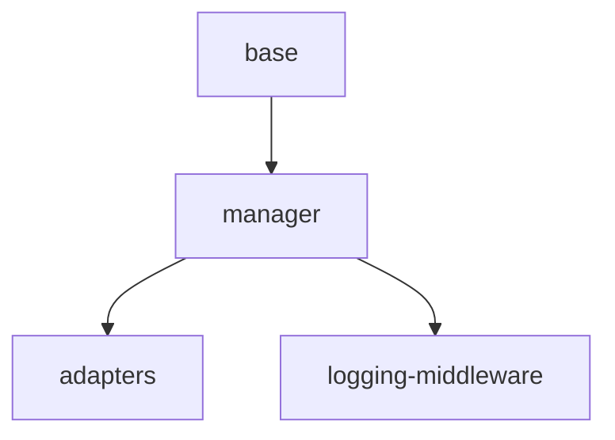

# Implementation Plan: Middleware System

## Goal

Implement a composable middleware pipeline following the onion execution model with three lifecycle phases (before, after, on_error), thread-safe management via the snapshot pattern, lightweight function adapters, and a built-in logging middleware with security-aware redaction.

## Architecture Design

### Component Structure

The middleware system consists of four components layered from base abstraction to concrete implementation:

- **`Middleware`** (`base.py`, 36 lines) -- Plain class (not ABC) with three methods (`before`, `after`, `on_error`) all returning `None` by default. Subclasses override only the methods they need. This avoids forcing implementations to provide stubs for unused phases.

- **`MiddlewareManager`** (`manager.py`, 129 lines) -- Manages an ordered list of `Middleware` instances and orchestrates the three execution phases. Uses `threading.Lock` with the snapshot pattern for thread safety.

- **`BeforeMiddleware` / `AfterMiddleware`** (`adapters.py`, 43 lines) -- Lightweight adapters wrapping a single callback function as a full `Middleware` subclass. Non-overridden phases remain no-ops, reducing boilerplate for single-phase hooks.

- **`LoggingMiddleware`** (`logging.py`, 94 lines) -- Structured logging middleware that uses `context.redacted_inputs` for security, records start time in `context.data["_logging_mw_start"]` during `before()`, computes duration in `after()`, and is configurable via `log_inputs`, `log_outputs`, `log_errors` flags.

### Data Flow

```
Inputs --> [MW1.before] --> [MW2.before] --> [MW3.before] --> Module.execute()
                                                                  |
Output <-- [MW1.after]  <-- [MW2.after]  <-- [MW3.after]  <------+

On Error (if MW2.before fails):
         [MW1.on_error] <-- [MW2.on_error]
```

- **before**: Registration order. Each `before()` may return a dict to replace inputs, or `None` to pass through. Failures raise `MiddlewareChainError` with the executed middlewares list.
- **after**: Reverse registration order. Each `after()` may return a dict to replace output, or `None` to pass through.
- **on_error**: Reverse order over only the middlewares whose `before()` was called. First handler returning a non-`None` dict provides recovery output.

### Technical Choices

- **Plain class over ABC**: `Middleware` is a plain class so it can be instantiated directly for testing and subclasses only override needed methods without `@abstractmethod` stubs.
- **Snapshot pattern**: `MiddlewareManager.snapshot()` acquires the lock, copies the list, and releases the lock. Execution then iterates the snapshot without holding the lock, allowing concurrent `add()`/`remove()` during in-flight pipelines.
- **Identity-based removal**: `remove()` uses `is` identity comparison rather than equality, preventing accidental removal of different middleware instances with identical state.
- **`MiddlewareChainError`**: Carries both `original` (root cause) and `executed_middlewares` so error recovery in `execute_on_error` targets only the middlewares that actually ran.

## Task Breakdown



| Task ID | Title | Estimated Time | Dependencies |
|---------|-------|---------------|--------------|
| base | Middleware base class with no-op defaults | 1h | none |
| manager | MiddlewareManager with onion execution and MiddlewareChainError | 3h | base |
| adapters | BeforeMiddleware and AfterMiddleware function adapters | 1h | manager |
| logging-middleware | LoggingMiddleware with structured logging and redaction | 2h | manager |

## Risks and Considerations

- **Thread safety under contention**: The snapshot pattern minimizes lock hold time, but very high-frequency add/remove during execution could still cause brief contention. Mitigated by copying the list in a single lock acquisition.
- **Error handler failures**: An `on_error` handler that itself raises could mask the original error. Mitigated by catching and logging exceptions in `execute_on_error`, then continuing iteration.
- **Input/output contract**: Middleware returning an unexpected type from `before()`/`after()` (e.g., a non-dict value) could break the pipeline. The contract is documented but not enforced at runtime to avoid overhead.

## Acceptance Criteria

- [ ] `Middleware` is a plain class (not ABC), can be instantiated directly, all methods return `None`
- [ ] `MiddlewareManager.execute_before` runs in registration order and tracks executed middlewares
- [ ] `MiddlewareManager.execute_after` runs in reverse registration order
- [ ] `MiddlewareManager.execute_on_error` iterates only executed middlewares in reverse; first dict wins
- [ ] `MiddlewareChainError` carries `original` exception and `executed_middlewares`
- [ ] Snapshot pattern ensures thread safety: concurrent add/remove during execution causes no errors
- [ ] `BeforeMiddleware` delegates `before()` to callback, leaves `after`/`on_error` as no-ops
- [ ] `AfterMiddleware` delegates `after()` to callback, leaves `before`/`on_error` as no-ops
- [ ] `LoggingMiddleware` uses `context.redacted_inputs` for security-aware logging
- [ ] `LoggingMiddleware` records duration via `context.data["_logging_mw_start"]`
- [ ] `LoggingMiddleware` respects `log_inputs`, `log_outputs`, `log_errors` configuration flags
- [ ] All tests pass with zero ruff/black/pyright warnings

## References

- Source: `src/apcore/middleware/base.py`, `manager.py`, `adapters.py`, `logging.py`
- Tests: `tests/test_middleware.py`, `tests/test_middleware_manager.py`
- Integration: `tests/integration/test_middleware_chain.py`
- Feature spec: [middleware-system.md](../../features/middleware-system.md)
