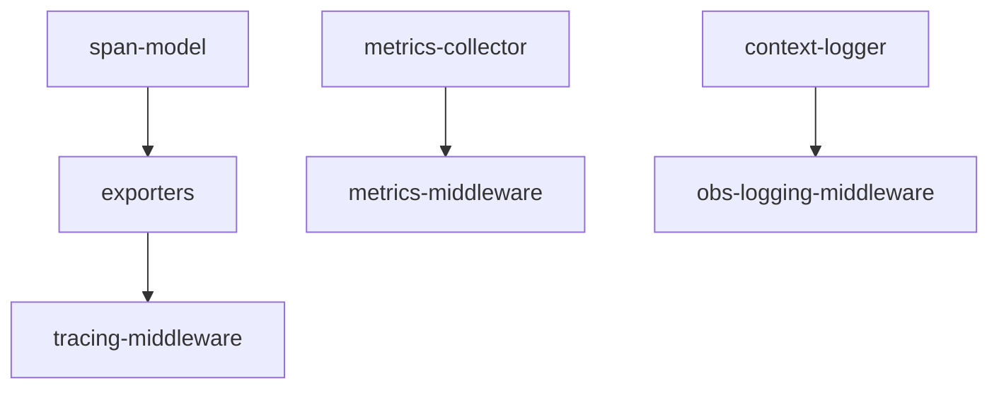

# Implementation Plan: Observability

## Goal

Build a comprehensive observability stack for the apcore module execution pipeline covering distributed tracing with multiple exporters and sampling strategies, thread-safe metrics collection with Prometheus export, and structured context logging with redaction -- all integrated into the middleware pipeline via stack-based context tracking.

## Architecture Design

### Component Structure

The observability system is organized into three pillars across three source files:

**Tracing Pillar** (`tracing.py`, 293 lines):
- **`Span`** -- Dataclass capturing trace_id, span_id (16-char hex via `os.urandom(8).hex()`), parent_span_id, name, start_time, end_time, status, attributes dict, and events list.
- **`SpanExporter`** -- `runtime_checkable` Protocol defining `export(span: Span) -> None`.
- **`StdoutExporter`** -- Converts span to dict via `dataclasses.asdict()` and writes as a single JSON line to stdout.
- **`InMemoryExporter`** -- Thread-safe bounded collection using `collections.deque(maxlen=max_spans)` with `threading.Lock`. Default capacity 10,000 spans. Provides `get_spans()` and `clear()`.
- **`OTLPExporter`** -- Bridges apcore spans to OpenTelemetry via `TracerProvider` and OTLP HTTP exporter. Adds `apcore.trace_id`, `apcore.span_id`, `apcore.parent_span_id` as attributes for correlation. Lazy-imports OTel packages with a clear `ImportError` message.
- **`TracingMiddleware`** -- Creates parent-child spans via a stack in `context.data["_tracing_spans"]`. Supports four sampling strategies: `full` (always), `proportional` (random at configurable rate), `error_first` (always export errors, proportional for successes), `off` (never). Sampling decisions are inherited from parent spans via `context.data["_tracing_sampled"]`.

**Metrics Pillar** (`metrics.py`, 195 lines):
- **`MetricsCollector`** -- Thread-safe in-memory store with `_counters`, `_histogram_sums`, `_histogram_counts`, and `_histogram_buckets` dictionaries protected by a single `threading.Lock`. Provides `increment()`, `observe()`, `snapshot()`, `reset()`, `export_prometheus()`, and convenience methods (`increment_calls`, `increment_errors`, `observe_duration`). Configurable histogram bucket boundaries (13 default buckets from 5ms to 60s).
- **`MetricsMiddleware`** -- Uses stack-based timing in `context.data["_metrics_starts"]`. Records `apcore_module_calls_total` (success/error), `apcore_module_errors_total` (with error code from `ModuleError.code` or `type(error).__name__`), and `apcore_module_duration_seconds`.

**Logging Pillar** (`context_logger.py`, 170 lines):
- **`ContextLogger`** -- Standalone structured logger with JSON and text output formats. Supports 6 log levels (trace/debug/info/warn/error/fatal). Injects trace_id, module_id, caller_id into every entry. Redacts `_secret_`-prefixed extra fields to `***REDACTED***` when `redact_sensitive=True`. Factory method `from_context()` auto-extracts context fields.
- **`ObsLoggingMiddleware`** -- Uses stack-based timing in `context.data["_obs_logging_starts"]`. Logs module call start/completion/failure with duration. Configurable `log_inputs` and `log_outputs` flags. Auto-creates a `ContextLogger` if none provided.

### Data Flow

```
Module call enters middleware pipeline:

TracingMiddleware.before() -- push Span to stack, make/inherit sampling decision
  MetricsMiddleware.before() -- push start time to metrics stack
    ObsLoggingMiddleware.before() -- push start time, log "Module call started"
      --> Module.execute()
    ObsLoggingMiddleware.after() -- pop start time, log "Module call completed" with duration
  MetricsMiddleware.after() -- pop start time, record success + duration metrics
TracingMiddleware.after() -- pop Span, finalize, export if sampled
```

### Technical Choices

- **Stack-based context tracking**: Each middleware stores per-call state as a stack in `context.data` rather than a single value. This correctly handles nested module-to-module calls where the same middleware instance processes multiple overlapping calls.
- **Bounded InMemoryExporter**: Uses `collections.deque(maxlen=...)` to automatically evict oldest spans when capacity is reached, preventing unbounded memory growth in tests and development.
- **Sampling decision inheritance**: Once a sampling decision is made for a trace, it is stored in `context.data["_tracing_sampled"]` and inherited by all child spans. This ensures consistent trace completeness.
- **Prometheus text format**: The `export_prometheus()` method produces standard Prometheus text exposition format with HELP/TYPE comments, allowing direct scraping without additional tooling.
- **Optional OTel dependency**: The `OTLPExporter` lazy-imports `opentelemetry-sdk` at instantiation time, so the tracing module can be imported without the optional dependency installed.

## Task Breakdown



| Task ID | Title | Estimated Time | Dependencies |
|---------|-------|---------------|--------------|
| span-model | Span dataclass and SpanExporter protocol | 1h | none |
| exporters | StdoutExporter, InMemoryExporter, OTLPExporter | 3h | span-model |
| tracing-middleware | TracingMiddleware with stack-based spans and sampling | 3h | exporters |
| metrics-collector | MetricsCollector with counters, histograms, Prometheus export | 3h | none |
| metrics-middleware | MetricsMiddleware with stack-based timing | 2h | metrics-collector |
| context-logger | ContextLogger with JSON/text formats and redaction | 2h | none |
| obs-logging-middleware | ObsLoggingMiddleware with stack-based timing | 2h | context-logger |

## Risks and Considerations

- **Thread safety in MetricsCollector**: A single lock protects all four internal dictionaries. Under very high concurrency, this could become a bottleneck. Acceptable for the current use case since metric recording is fast (dict lookups and integer arithmetic).
- **Bounded memory in InMemoryExporter**: The deque silently drops oldest spans when full. In testing scenarios, this means older spans may disappear if more than `max_spans` are exported. The default of 10,000 is generous for typical test suites.
- **OTLPExporter dependency availability**: If OpenTelemetry packages are not installed, `OTLPExporter` raises `ImportError` at construction time. Other exporters remain fully functional.
- **Stack safety for nested calls**: If a middleware's `before()` is called but `after()` is never called (e.g., due to an unhandled exception in the module), the stack will have a stale entry. The `on_error()` handler pops the stack to handle this case.
- **Non-primitive OTel attributes**: The OTLPExporter stringifies non-primitive attribute values since OpenTelemetry only supports primitive types. This may reduce queryability in backends.

## Acceptance Criteria

- [ ] `Span` dataclass creates with all required fields; `span_id` is auto-generated 16-char hex
- [ ] `StdoutExporter` writes valid JSON lines; `InMemoryExporter` is bounded and thread-safe
- [ ] `OTLPExporter` bridges to OpenTelemetry correctly; raises `ImportError` when packages missing
- [ ] `TracingMiddleware` creates parent-child spans via stack; all four sampling strategies work
- [ ] `MetricsCollector` correctly tracks counters and histograms; Prometheus export is valid
- [ ] `MetricsMiddleware` records calls, errors, and duration with stack-based timing
- [ ] `ContextLogger` supports JSON/text formats, context injection, and `_secret_` redaction
- [ ] `ObsLoggingMiddleware` logs start/completion/failure with duration
- [ ] Nested module calls produce correct isolated metrics and parent-child span relationships
- [ ] Thread safety validated for `InMemoryExporter` and `MetricsCollector`
- [ ] All tests pass with zero ruff/black/pyright warnings

## References

- Source: `src/apcore/observability/tracing.py`, `metrics.py`, `context_logger.py`
- Tests: `tests/observability/test_tracing.py`, `test_metrics.py`, `test_context_logger.py`
- Feature spec: [observability.md](../../features/observability.md)
- Recommended middleware registration order: TracingMiddleware (outermost) > MetricsMiddleware > ObsLoggingMiddleware (innermost)
