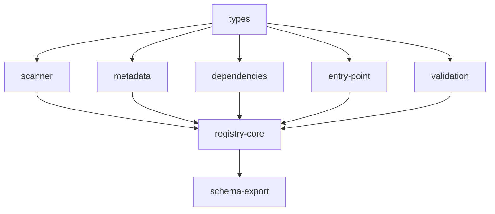

# Implementation Plan: Registry System

## Goal

Implement the central module registry with an 8-step discovery pipeline, thread-safe module store, lifecycle hooks, event callbacks, flexible querying, and schema export utilities, serving as the single source of truth for all module instances accessible to the executor.

## Architecture Design

### Component Structure

- **Registry** (`registry/registry.py`, 410 lines) -- Central registry class coordinating the 8-step discovery pipeline and providing query methods. Accepts optional `Config`, `extensions_dir` (single root), `extensions_dirs` (multi-root, mutually exclusive with `extensions_dir`), and `id_map_path`. Internal state protected by `threading.RLock`: `_modules` (id -> instance), `_module_meta` (id -> merged metadata dict), `_callbacks` (event -> callback list), `_schema_cache`. Supports manual registration via `register()`/`unregister()` with lifecycle hooks and event emission.

- **Scanner** (`registry/scanner.py`, 156 lines) -- `scan_extensions()` recursively walks a single extension root directory identifying `.py` files as module candidates. Skips `__pycache__`, `node_modules`, dotfiles, underscore-prefixed files, and `.pyc` files. Detects duplicate module IDs (logs error, keeps first), case collisions between IDs (logs warning), and symlink cycles (when `follow_symlinks=True`). Enforces configurable `max_depth` (default 8). `scan_multi_root()` handles multiple roots with namespace prefixing, validating namespace uniqueness.

- **Metadata** (`registry/metadata.py`, 123 lines) -- `load_metadata()` reads `*_meta.yaml` companion files, returning empty dict for missing files. `parse_dependencies()` converts raw YAML dependency dicts to typed `DependencyInfo` objects. `merge_module_metadata()` merges YAML metadata over code-level class attributes (YAML wins on conflicts) for description, name, tags, version, annotations, examples, metadata, and documentation. `load_id_map()` loads ID Map YAML files for canonical ID overrides with `mappings` list validation.

- **Dependencies** (`registry/dependencies.py`, 112 lines) -- `resolve_dependencies()` performs Kahn's topological sort on the module dependency graph. Builds in-degree map and adjacency list. Uses a sorted deque for deterministic ordering of zero-in-degree nodes. Optional dependencies are skipped with a warning when missing; required dependencies raise `ModuleLoadError`. Circular dependencies raise `CircularDependencyError` with extracted cycle path via `_extract_cycle()`.

- **EntryPoint** (`registry/entry_point.py`, 91 lines) -- `resolve_entry_point()` dynamically imports Python files using `importlib.util.spec_from_file_location()`. Auto-infer mode uses duck-type detection: checks for `input_schema` (BaseModel subclass), `output_schema` (BaseModel subclass), and `execute` (callable) on classes defined in the loaded module. Meta override mode parses `entry_point` field as `filename:ClassName`. Raises `ModuleLoadError` for no candidates, ambiguous candidates, or missing specified class.

- **Validation** (`registry/validation.py`, 46 lines) -- `validate_module()` checks a class or instance for: `input_schema` (must be a `BaseModel` subclass), `output_schema` (must be a `BaseModel` subclass), `description` (non-empty string), and `execute` (callable). Returns a list of error strings; empty list means valid.

- **SchemaExport** (`registry/schema_export.py`, 189 lines) -- `get_schema()` builds a structured schema dict from a registered module's attributes including `input_schema`, `output_schema`, annotations, and examples. `export_schema()` serializes to JSON or YAML with optional strict mode (`to_strict_schema`), compact mode (truncated descriptions, stripped extensions), or profile-based export (MCP/OpenAI/Anthropic/generic via `SchemaExporter`). `get_all_schemas()` and `export_all_schemas()` aggregate across all registered modules.

- **Types** (`registry/types.py`, 51 lines) -- `ModuleDescriptor` (cross-language compatible descriptor with schemas, annotations, examples), `DiscoveredModule` (intermediate representation with file path, canonical ID, meta path, namespace), `DependencyInfo` (module_id, version, optional flag).

### Data Flow

The 8-step discovery pipeline:

1. **Extension Directory Scanning** -- `scan_extensions()` or `scan_multi_root()` walks configured roots, producing `DiscoveredModule` objects with file paths and canonical IDs
2. **ID Map Override** -- If configured, remaps canonical IDs by matching relative file paths against map entries
3. **Metadata Loading** -- `load_metadata()` reads `*_meta.yaml` companion files for each discovered module
4. **Entry Point Resolution** -- `resolve_entry_point()` dynamically imports each Python file and resolves the module class
5. **Module Validation** -- `validate_module()` checks each class for required attributes
6. **Dependency Collection** -- Extracts and parses dependencies from metadata into `DependencyInfo` objects
7. **Dependency Resolution** -- `resolve_dependencies()` performs topological sort, detecting cycles and missing required dependencies
8. **Registration** -- Instantiates classes in dependency order, merges metadata, stores under `RLock`, calls `on_load()`, emits `register` event

### Technical Choices and Rationale

- **`threading.RLock`** (reentrant lock): Allows lifecycle hooks and event callbacks to safely call back into the registry (e.g., querying other modules during `on_load()`). All public methods acquire the lock before accessing internal state.
- **Kahn's algorithm** with sorted zero-in-degree queue: Produces deterministic topological ordering regardless of input order. Sorted queue ensures reproducible registration order across runs.
- **Duck-type auto-inference**: Avoids requiring modules to inherit from a specific base class. Any class with `input_schema`, `output_schema`, and `execute` qualifies as a module.
- **YAML > code merge priority**: Allows operators to override module behavior via metadata files without modifying source code. Code-defined values serve as defaults.
- **Lifecycle hooks with rollback**: If `on_load()` fails, the module is removed from the registry before the error propagates, ensuring consistent registry state.
- **Event callbacks with error swallowing**: Callback exceptions are logged but do not break registration, preventing one faulty observer from blocking the entire discovery pipeline.

## Task Breakdown

| Task ID | Title | Estimated Time | Dependencies |
|---------|-------|---------------|--------------|
| types | DiscoveredModule, ModuleDescriptor, DependencyInfo type definitions | 1h | none |
| scanner | Multi-root extension directory scanning | 3h | types |
| metadata | YAML metadata loading, parsing, and merging | 2h | types |
| dependencies | Topological sort via Kahn's algorithm with cycle detection | 3h | types |
| entry-point | Entry point resolution with duck-type detection | 2h | types |
| validation | Module structural validation | 1h | types |
| registry-core | Central Registry class with discover() pipeline and query methods | 5h | scanner, metadata, dependencies, entry-point, validation |
| schema-export | Schema export utilities with profiles and formats | 3h | registry-core |

## Risks and Considerations

- **Dynamic import security**: `resolve_entry_point()` uses `importlib.util.spec_from_file_location()` to dynamically import Python files from extension directories. Malicious or buggy extension files execute arbitrary code at import time. Mitigated by only scanning configured extension directories.
- **Symlink cycles**: When `follow_symlinks=True`, the scanner tracks visited real paths to detect cycles. If a symlink points outside the extension root, it is still followed but depth limits apply.
- **Case collisions**: On case-insensitive filesystems (macOS, Windows), module IDs differing only by case may refer to the same file. The scanner logs a warning but does not prevent registration.
- **Thread safety during discovery**: The `discover()` method does not hold the write lock during the entire pipeline (only during individual registration steps). Concurrent `discover()` calls could lead to duplicate registration attempts, which are handled by the `InvalidInputError` check in `register()`.
- **Callback ordering**: Event callbacks are invoked in registration order. There is no priority mechanism or guaranteed ordering between callbacks registered at different times.

## Acceptance Criteria

- [ ] 8-step discovery pipeline registers modules from extension directories in correct dependency order
- [ ] Duplicate module IDs are detected and logged; only the first is kept
- [ ] Case collisions between module IDs produce warning logs
- [ ] Symlink cycles are detected and skipped when `follow_symlinks` is True
- [ ] Multi-root scanning prefixes canonical IDs with namespace
- [ ] ID map overrides remap canonical IDs and inject class overrides
- [ ] Metadata merging follows YAML > code > defaults priority
- [ ] Kahn's topological sort produces deterministic order (sorted zero-in-degree queue)
- [ ] Circular dependencies raise `CircularDependencyError` with extracted cycle path
- [ ] Optional dependencies are skipped when missing; required dependencies raise `ModuleLoadError`
- [ ] Entry point resolution auto-infers single module classes; rejects ambiguous files
- [ ] Module validation checks `input_schema`, `output_schema`, `description`, `execute`
- [ ] Lifecycle hooks (`on_load`, `on_unload`) are called at appropriate times; `on_load` failures roll back registration
- [ ] Event callbacks are invoked with correct arguments; callback errors are logged and swallowed
- [ ] Thread-safe `RLock` protects all public methods
- [ ] Schema export supports JSON/YAML format, strict/compact modes, and profile-based export
- [ ] All tests pass with `pytest`; zero errors from `ruff`, `black`, and `pyright`

## References

- `src/apcore/registry/registry.py` -- Central registry with discover() pipeline (410 lines)
- `src/apcore/registry/scanner.py` -- Multi-root extension directory scanning (156 lines)
- `src/apcore/registry/metadata.py` -- YAML metadata loading and merging (123 lines)
- `src/apcore/registry/dependencies.py` -- Topological sort with cycle detection (112 lines)
- `src/apcore/registry/entry_point.py` -- Entry point resolution with duck-type detection (91 lines)
- `src/apcore/registry/validation.py` -- Module structural validation (46 lines)
- `src/apcore/registry/schema_export.py` -- Schema query and export utilities (189 lines)
- `src/apcore/registry/types.py` -- Shared type definitions (51 lines)
- [Registry System Feature Specification](../../features/registry-system.md)
