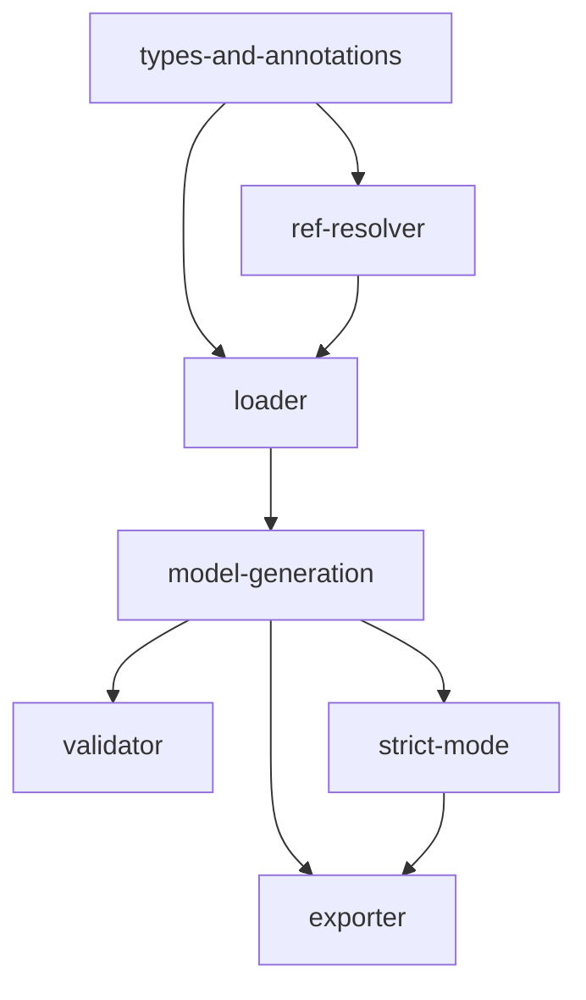

# Implementation Plan: Schema System

## Goal

Implement a complete schema loading, validation, `$ref` resolution, and export system that converts YAML-authored schemas into runtime Pydantic models, resolves references with circular detection, validates data with structured error output, and exports schemas to multiple LLM provider formats (MCP, OpenAI, Anthropic, generic).

## Architecture Design

### Component Structure

- **SchemaLoader** (`schema/loader.py`, 391 lines) -- Primary entry point. Reads YAML schema files requiring `input_schema`, `output_schema`, and `description` fields. Resolves `$ref` references via `RefResolver`, then generates Pydantic `BaseModel` subclasses using `create_model()`. Supports three resolution strategies via `SchemaStrategy` enum: `yaml_first` (default, falls back to native), `native_first` (prefers code-defined, falls back to YAML), `yaml_only` (raises on missing YAML). Maintains two caches: `_schema_cache` for parsed `SchemaDefinition` objects and `_model_cache` for resolved `(ResolvedSchema, ResolvedSchema)` tuples.

- **RefResolver** (`schema/ref_resolver.py`, 206 lines) -- Resolves `$ref` references within JSON Schema documents. Supports local (`#/definitions/Foo`), cross-file (`other.yaml#/definitions/Bar`), and canonical (`apcore://module.id/path`) references. Uses a visited-set for circular detection and enforces `max_depth=32`. Deep-copies resolved targets to prevent mutation of cached schemas. Uses an inline sentinel (`Path("__inline__")`) for local `$ref` resolution without a file path. Caches parsed files for performance.

- **SchemaValidator** (`schema/validator.py`, 109 lines) -- Validates data dicts against Pydantic models with configurable type coercion (`coerce_types`). Maps Pydantic v2 error types to apcore-standard constraint names (e.g., `missing` -> `required`, `string_too_short` -> `minLength`, `literal_error` -> `enum`, `extra_forbidden` -> `additionalProperties`). Returns `SchemaValidationResult` with structured `SchemaValidationErrorDetail` entries. Provides `validate_input()` and `validate_output()` convenience methods that raise `SchemaValidationError` on failure.

- **SchemaExporter** (`schema/exporter.py`, 99 lines) -- Stateless transformer converting `SchemaDefinition` objects to platform-specific formats:
  - **MCP**: Preserves `x-*` fields, uses dot-notation module IDs, includes `annotations` (readOnlyHint, destructiveHint, idempotentHint, openWorldHint)
  - **OpenAI**: Applies strict mode (`to_strict_schema`), replaces dots with underscores in names, wraps in `type: "function"` with `strict: true`
  - **Anthropic**: Strips `x-*` extensions, replaces LLM descriptions, supports `input_examples` from `ModuleExample` objects
  - **Generic**: Full pass-through with `input_schema`, `output_schema`, and `definitions`

- **Strict Mode** (`schema/strict.py`, 105 lines) -- `to_strict_schema()` deep-copies input, strips `x-*` extensions and defaults, sets `additionalProperties: false` on all object types, makes all properties required, and wraps optional fields as nullable (`[type, "null"]` or `oneOf` with null). Recursively processes nested objects, arrays, composition keywords, and definitions.

- **Annotations** (`schema/annotations.py`, 62 lines) -- `merge_annotations()`, `merge_examples()`, and `merge_metadata()` functions implementing YAML > code > defaults priority resolution. Annotations use `ModuleAnnotations` dataclass fields; examples convert YAML dicts to `ModuleExample` objects.

### Data Flow

```
YAML file -> SchemaLoader.load() -> SchemaDefinition (raw dict with input/output schemas)
          -> RefResolver.resolve() -> Resolved dict (all $ref inlined, deep-copied)
          -> SchemaLoader.generate_model() -> Pydantic BaseModel subclass (via create_model)
          -> ResolvedSchema (cached in _model_cache)
          -> SchemaValidator.validate() or SchemaExporter.export()
```

### Technical Choices and Rationale

- **Pydantic v2 `create_model()`** for dynamic model generation: Generates full-featured `BaseModel` subclasses at runtime from JSON Schema properties, supporting validation, serialization, and JSON schema export.
- **`Union` types for `oneOf`/`anyOf`**: Pydantic's discriminated union support maps naturally to JSON Schema composition.
- **`Annotated` with `AfterValidator`** for `uniqueItems`: No native Pydantic constraint for list uniqueness, so a custom validator checks `len(v) != len(set(v))`.
- **Deep copy in RefResolver**: Prevents mutation of cached schemas when resolved fragments are inlined into parent documents.
- **Inline sentinel** (`Path("__inline__")`): Allows local `$ref` resolution against the current schema dict without requiring a file path.
- **Strategy pattern** for schema resolution: Enables flexible deployment configurations where YAML schemas can override or complement code-defined schemas.
- **Stateless exporter**: Each export call is independent, making the exporter safe for concurrent use without synchronization.

## Task Breakdown



| Task ID | Title | Estimated Time | Dependencies |
|---------|-------|---------------|--------------|
| types-and-annotations | SchemaDefinition, ResolvedSchema, LLMExtensions types and annotation merging | 2h | none |
| loader | SchemaLoader with YAML parsing and strategy-based resolution | 4h | types-and-annotations, ref-resolver |
| ref-resolver | $ref resolution with circular detection (max_depth=32) | 4h | types-and-annotations |
| model-generation | Dynamic Pydantic model generation from JSON Schema | 5h | loader |
| validator | Schema validation with Pydantic error mapping | 3h | model-generation |
| exporter | Schema export to MCP/OpenAI/Anthropic/generic formats | 3h | model-generation, strict-mode |
| strict-mode | Strict mode conversion (additionalProperties: false) | 2h | model-generation |

## Risks and Considerations

- **JSON Schema coverage**: The generator supports primitives, objects, arrays, `oneOf`/`anyOf`/`allOf`, `const`, `enum`, nullable types, and constraints. Keywords `not` and `if/then/else` are explicitly unsupported and raise `SchemaParseError`.
- **`allOf` with non-object sub-schemas**: Only object-type sub-schemas with `properties` are supported in `allOf` merging. Non-object sub-schemas raise a parse error.
- **Circular reference depth**: The `max_depth=32` limit is a hard safety bound. Deeply nested but non-circular schemas that exceed this limit will be incorrectly rejected as circular.
- **Cache invalidation**: `clear_cache()` clears all internal caches (schema, model, and file caches). There is no partial invalidation; the entire cache is flushed.
- **LLM description override**: `_apply_llm_descriptions()` replaces `description` with `x-llm-description` when both are present. This mutation happens in-place on a deep copy before export.

## Acceptance Criteria

- [ ] SchemaLoader correctly parses YAML files with `input_schema`, `output_schema`, and `description` fields
- [ ] All three resolution strategies work: `yaml_first` falls back to native, `native_first` falls back to YAML, `yaml_only` raises on missing YAML
- [ ] RefResolver inlines all `$ref` references and detects circular references
- [ ] `max_depth=32` prevents runaway resolution
- [ ] Dynamic Pydantic models enforce constraints: required/optional, min/max, pattern, enum, `oneOf`/`anyOf`/`allOf`, `uniqueItems`
- [ ] SchemaValidator maps Pydantic errors to apcore constraint names with structured error details
- [ ] SchemaExporter produces correct format for MCP, OpenAI, Anthropic, and generic profiles
- [ ] Strict mode sets `additionalProperties: false`, makes all fields required, wraps optional in nullable
- [ ] Schema and model caches prevent redundant parsing
- [ ] `x-*` extension fields are preserved in `json_schema_extra` on generated models
- [ ] All tests pass with `pytest`; zero errors from `ruff`, `black`, and `pyright`

## References

- `src/apcore/schema/loader.py` -- Primary schema loading and model generation (391 lines)
- `src/apcore/schema/ref_resolver.py` -- $ref resolution with circular detection (206 lines)
- `src/apcore/schema/types.py` -- Type definitions and data structures (109 lines)
- `src/apcore/schema/validator.py` -- Data validation with error mapping (109 lines)
- `src/apcore/schema/exporter.py` -- Multi-format schema export (99 lines)
- `src/apcore/schema/strict.py` -- Strict mode conversion (105 lines)
- `src/apcore/schema/annotations.py` -- Annotation conflict resolution (62 lines)
- [Schema System Feature Specification](../../features/schema-system.md)
